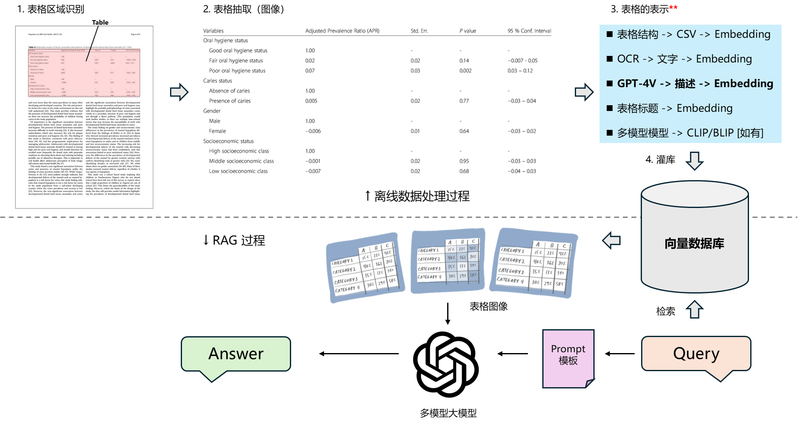

# LLMs-Lab-2024

This repository contains projects, research, and educational resources focused on Large Language Models (LLMs).

## 1. Task-oriented Dialogue System

   This demo implements a multi-turn, task-oriented intelligent customer service system using gpt-3.5-turbo API.
   
## 2. Function-Calling

This folder contains various demos showcasing the capabilities of Function Calling.

### Function Calling Demos

   - **`POI(Point of Interest)`**:
       
     This demo uses Amap's (Gaode Map) public API to retrieve information about hotels, restaurants, attractions, and other points of interest (POIs) near a specific location. It allows querying nearby POIs relative to a given point.

   - **`SQL`**:
       
     This demo demonstrates how Function Calling handles sophisticated database tasks and generates SQL queries.

   - **`Stream`**:
       
     This demo showcases examples of Function Calling in Stream mode.

## 3. RAG

This folder contains tree different **RAG (Retrieval-Augmented Generation)** pipelines. The first one is based on Elasticsearch (ES), the second one is based on a vector database, ChromaDB, and the last RAG Pipline show how to use data from tables in PDFs to implement RAG.  
  

### Pipelines

- **`run_RAG_vector_database_pipeline`**:
    
  RAG Pipeline based on ChromaDB Vector Database.

      The Offline Steps are as follows:  

      | Document Loading      | Document Splitting  | Vectorization | Insert into Vector Database  |
      |-----------------------|---------------------|---------------|------------------------------|
      |          →            |        →            |      →        |               →              |
      
      The Online Steps are as follows:  
      
      | Receive User Query    | Vectorize User Query | Retrieve from Vector Database | Populate Prompt Template  | Call LLM with Final Prompt | Generate Response   |
      |-----------------------|----------------------|-------------------------------|---------------------------|----------------------------|---------------------|
      |           →           |           →          |                →              |                 →         |                →           |          →          |  

- **`run_RAG_ES_pipeline`**:
    
  RAG Pipeline based on Elasticsearch (ES).

- **`RAG_pipeline_pdf_table_processing`**:  
    
  In this RAG Pipline, use data from tables in PDFs to implement RAG.    
  
  Offline:  
    
  Convert PDF to images and extract tables from the images → Use GPT-4 to generate textual descriptions of the table images → Store the textual descriptions (documents), their embeddings (embeddings), and image URLs (metadatas) into the vector database.
    
  Online:
    
  Receive a query and search the vector database → Retrieve table image URLs from search results (based on similarity between textual descriptions and the query) → Use GPT-4 to query and retrieve information from the table images.
    
      
  The pipeline flowchart is as follows:
    
  
    
## 4. Semantic-Kernel

The code examples in this folder, including **Prompt Templates**, **Nested Function Calls**, **RAG**, and **Using the Planner to Implement Agent Development**, demonstrate the features and basic usage of Semantic Kernel. They also provide an understanding of its built-in tools, illustrating how the SDK can be used to simplify the development of LLM-based applications.

## 5. LangChian

#### The contents of the 'LangChain.ipynb' file located in the LangChain folder are detailed below:  

### Core Components of LangChain

- #### Model I/O Wrapping

**LLMs**: Large Language Models  
**Chat Models**: Generally based on LLMs but restructured for conversational purposes  
**PromptTemplate**: Templates for prompt creation  
**OutputParser**: Parses the output from models  

  - #### Data Connection Wrapping  

**Document Loaders**: Loaders for various file formats  
**Document Transformers**: Common operations on documents such as splitting, filtering, translating, and extracting metadata  
**Text Embedding Models**: Convert text into vector representations, useful for tasks like retrieval  
**Vectorstores**: Stores for vectors (used in retrieval tasks)  
**Retrievers**: Tools for retrieving vectors from storage  
**RAG Pipline with Langchain**

- #### Memory Wrapping

**Memory**: Not physical memory; it manages "context", "history", or "memory" from a text perspective

- #### Architecture Wrapping

**Chain**: Implements a single function or a series of sequential functions, LangChain Expression Language (LCEL)   
**Agent**: Automatically plans and executes steps based on user input, selecting the necessary tools for each step to achieve the desired task  
**Tools**: Functions for calling external functionalities, such as Google search, file I/O, Linux shell, etc.    
**Toolkits**: A set of tools designed to operate specific software, such as a toolkit for managing databases or Gmail    

- #### Callbacks  

## 6. Agent
The contents of this folder include an overall introduction to the Agent, as well as an Agent project implemented from scratch.  

## 7. Fine-Tuning  
Studying fine-tuning of LLMs, working with LLM-related code, and reviewing papers and experiments on LLMs.  
